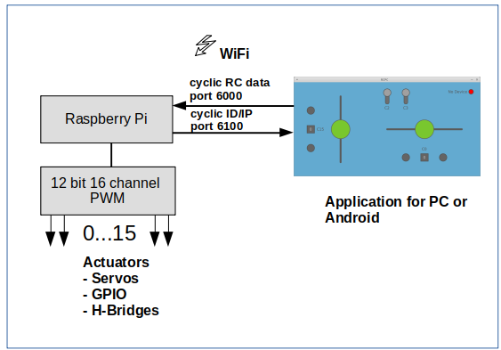

#Overview
Picture 1 depict the system overview. The system consist of a Raspberry Pi as a  receiver and a 12-Bit PWM module that is connected to the Raspberry Pi via the I2C interface. The PWM module drives up to 16 actuators like LEDs, relays and H-bridges.  Optionally other Sensors could be used on the Raspberry Pi e.g. a GPS module, a distance sensor, a camera or acoustic and optical signal transmitter. There are hardly limits to expand the functionality. The transmitter has been build as a Android or PC application. Both components communicate via cyclic UDP telegrams and have access to the same local network via WiFi. 

Abbildung 1 stellt die Übersicht des System dar. Das System besteht aus einem Raspberry Pi als Empfänger und einem 12-Bit PWM-Modul, das mit dem Raspberry via I2C Schnittstelle verbunden ist. An das PWM-Modul können bis zu 16 Aktoren angeschlossen werden. Es können 
Servos, digital I/O Aktoren wie LEDs oder Relais und H-Brücken verwendet werden. Optional können direkt am den Raspberry noch andere Sensoren, wie z.B. ein GPS-Modul, ein Abstandsensor, eine Kamera oder akustische und optische Signalgeber angeschlossen werden. Damit sind dem weiteren Ausbau kaum Grenzen gesetzt. Als Fernsteuersender wird ein Applikation verwendet, die entweder auf einem normales Handy, Tablett läuft, oder während der Testphase auf einem PC seinen Dienst tut. Beide Komponenten kommunizieren über zyklische UDP-Telegramme und sind in einem lokalen WiFi Netz angemeldet.

Picture/Abbildung 1: System Overview

You will soon find the complete documentation in the [./doc](./doc)  folder. 

Sie finden bald die komplette Dokumentation in dem [./doc](./doc) Verzeichnis. 